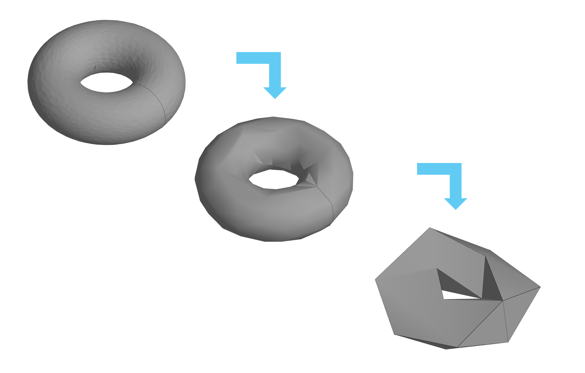
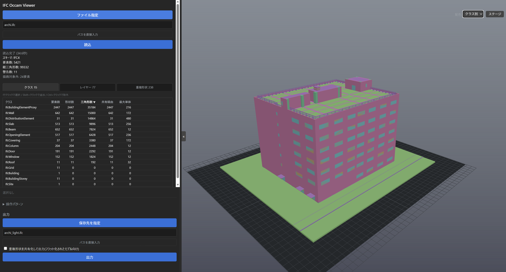
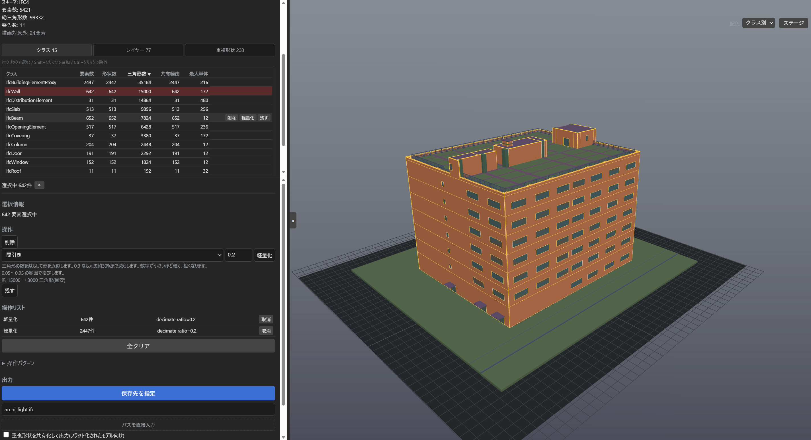

# IFC Occam

**English** | [日本語](README.ja.md)

[](https://github.com/Kurikara-dev/ifc-occam/actions/workflows/ci.yml)

A workbench for cutting oversized IFC (ISO 16739) models down to a size that ordinary BIM tools can actually open. You decide what goes — **by IFC class, not element by element** — and the tool writes a smaller derivative file. Your original file is never modified.



*Decimation applied in stages. The triangle count drops but you can still read what is where — cutting only as far as the model stays readable is the whole job.*

> **Two things to know before you read further.** The user interface — both the web UI and the interactive command loop — is **Japanese only**; the code, comments, and design notes are Japanese too. Development and testing happen on Windows. Everything else below still applies, but if neither of those works for you, this probably isn't the tool you want.

## The problem

IFC files from detail-heavy workflows — steel fabrication is the usual culprit — accumulate bolts, welds, small fittings, and plates until one model is hundreds of megabytes or several gigabytes. General-purpose BIM tools stall or fail to open them at all.

Reviewing such a model element by element is not realistic. What works is deciding by class: look at a ranked breakdown of which IFC classes dominate the element and triangle counts, then make a handful of coarse, deliberate calls — *remove every fastener*, *reduce every plate to a bounding box* — instead of thousands of individual judgements.

A measured example. A 102 MB building-services model with 11,273 elements and 2.23 million triangles: deleting one accessory class (2,728 elements) and reducing a fitting class (1,784 elements) to bounding boxes produced a 78 MB file with 1.43 million triangles — **36% fewer triangles, 24% fewer bytes** — with no dangling references and no new geometry warnings. The triangle count, more than the byte count, is what decides whether a viewer can handle the model.

Byte-count impact varies by model and by which classes you touch. On a smaller, 21.5 MB building-services model, reducing 305 pipe-fitting elements to convex hulls (propagated across their shared geometry) produced a 17.5 MB file — **18.7% smaller** — again with zero dangling geometry references, and with colour information intact on every simplified element.

## Before you start

| | |
|---|---|
| **Input** | `.ifc` STEP files. Tested against IFC4 and IFC2X3. |
| **Output** | A new `.ifc` file (the CUI defaults to `<input>_light.ifc`). The input is never written to. |
| **UI language** | Japanese only. |
| **Platform** | Windows (developed and tested there). The Python code has no OS-specific dependencies; only the convenience launchers are `.bat`. |
| **Python** | 3.11 or newer. |
| **Standing** | Output is a **reference-only derivative**, never a design or construction record. See [Disclaimer](#disclaimer). |

## Install

```bash
git clone https://github.com/Kurikara-dev/ifc-occam.git
cd ifc-occam
python -m venv .venv
```

Activate the virtual environment — `.venv\Scripts\activate` on Windows, `source .venv/bin/activate` elsewhere — then:

```bash
pip install -e .
```

Add `".[dev]"` instead of `.` if you also want the test dependencies, then run `pytest` to check your install (the suite takes about ten minutes; most of it is real-model integration tests).

If installation fails, it is almost always `ifcopenshell`: it ships platform- and Python-version-specific wheels, so a mismatch there is the usual cause. This project is developed against ifcopenshell 0.8.5.

On Windows you can skip the command line entirely once the virtual environment exists: **double-click `start.bat`** to launch the GUI. (`start-exe.bat` runs a PyInstaller build from `dist/` — either one you built yourself or a Windows binary from [Releases](https://github.com/Kurikara-dev/ifc-occam/releases), unpacked so that `dist\ifc_occam\ifc_occam.exe` exists.)

## Which mode do I want?

| Your model | Mode | What you get |
|---|---|---|
| up to roughly 300 MB | **GUI** | 3D viewer, click to select, see what you are about to delete |
| roughly 300 MB – 2 GB | **CUI** | text scan, then class-level decisions, then one full open-and-export pass |
| bigger than that, or when a full open will not fit in RAM | **CUI text mode** (`--text`) | deletions applied by rewriting the STEP text; the model is never fully opened |

The rule of thumb behind the middle row: opening a model with `ifcopenshell` needs roughly **14× the file size in RAM** (measured and calibrated). A 1.2 GB model peaked at 14.75 GB. The CUI estimates this before you commit and warns you when it looks unaffordable.

### GUI

```bash
python -m ifc_occam serve
```

Open the printed URL. Pick a model through the **file dialog** (browsing is confined to the folder you launched the server from; a collapsed manual-path field is still there if you'd rather type it). The sidebar has three tabs — class, layer, and duplicate-shape groups — each row showing element/shape/triangle counts, with delete/simplify/keep quick-action buttons that appear on hover. Select elements in the viewer or act on a whole class/layer at once; delete, reduce to a bounding box, take a convex hull, or decimate; save named **operation patterns** (reusable rule sets, applied with a per-rule count you confirm first) for reuse across models. Export goes through a **save dialog** too, and it refuses a filename that resolves to the file you loaded. The 3D view sits the model on a gridded floor sized to its bounding box, which gives both the extent and which way is up (toggle with the "ステージ" button); selecting something dims everything else and outlines the selection. Camera controls: right-drag to rotate around the point under the cursor, left-drag to look around without moving the camera, drag the wheel button to pan, and scroll the wheel to zoom; a plain left-click (no movement) selects. A colour-mode toggle switches the view between the model's own IFC colours and automatic per-class colours. If port 8000 is busy the server picks the next free port and prints it.



*Just after loading. The sidebar ranks classes by triangle count; the 3D view is coloured per class.*



*Selecting IfcWall (642 elements) from the list highlights it in the 3D view and dims everything else. Queued operations collect in the operation list — nothing touches the source file until you export.*

### CUI

```bash
python -m ifc_occam cui heavy_steel.ifc
```

A lightweight scan of the raw STEP text — no geometry engine, no full open — produces a per-class ranking in seconds to minutes, then hands you a command loop:

```
IFC Occam CUI — 軽量スキャン中...
=== クラス別ランキング (推定Face数[展開]降順) ===
...
操作を入力してください (h でヘルプ):
> delete IfcMechanicalFastener
> bbox IfcPlate
> list
> apply
```

Commands: `delete`, `bbox`, `hull`, `decimate`, `keep`, `undo`, `list`, `rank`, `apply`, plus `help` and `quit`. Nothing touches disk until `apply`, and `apply` asks you to confirm twice — once on the operation summary, once after the real file has been read and the deletion cascade has been expanded, so you see how many extra elements come along with your choices before anything is written. It also prompts for the output filename.

Simplification commands propagate across shared geometry by default — reducing one class also reduces the shared shapes it uses, exactly like the GUI's 共有波及 option — and the confirmation screen discloses how many elements outside your selection will change; append `element` to a command to simplify per element instead.

`--scan-only` prints the ranking and exits, which is the fast way to size up a model you have never seen.

`--inline-cleanup` writes the output in a low-memory mode: instead of the default one-shot garbage collection at write time, which temporarily needs several times the model's size in RAM, old geometry is reclaimed piece by piece as each shape is simplified. It is the same switch as the GUI's 省メモリ checkbox. It keeps the same elements, geometry and GlobalIds, and for the same input and the same operations its output matches the one-shot GC's byte for byte, as long as shape consolidation is off (its default) — consolidation picks shared-shape representatives in a non-deterministic order, so with it on the two outputs are equivalent but not byte-identical. An earlier release could leave a few percent of stale geometry behind in this mode, which is why older notes mention a size difference, but that gap is closed; the piece-by-piece reclamation can make the cleanup stage slower than the one-shot GC. It has no effect in text mode, which never opens the model in the first place.

### Text mode: for models you cannot open

Some models are not merely large but hostile to element-by-element editing. On one real family of models, `ifcopenshell`'s per-element deletion measured **~22 seconds per element** — 456 elements would have taken 2.8 hours — while a comparable model deleted at 110–140 ms per element. Text mode exists for those cases, and for models too big to open at all.

```bash
python -m ifc_occam cui huge_model.ifc --text
```

When every pending operation is a deletion, the CUI offers to apply it by rewriting the STEP file as a byte stream: it scans the reference graph, works out which records die with your targets (openings and their fillings, aggregated children, and any records left referenced by nothing), patches the reference lists of the relationship records that survive, and streams everything else through untouched. `ifcopenshell` is never called.

The mode is offered only for delete-only operation sets — bounding boxes, hulls, and decimation need a geometry engine — and only when you pass `--text` or the memory estimate above has already warned you. Its correctness is pinned by an equivalence test: for the same deletion, the text path and the ordinary full-open path must produce the same surviving elements and the same geometry. Read [Limits](#limits-and-known-gaps) for what that test does *not* cover.

## What this tool never does

- **It never modifies your input file.** If you point the output at the input, it refuses and stops.
- **It never decides for you.** There is no automatic optimisation pass: a human selects, confirms, and applies every change.
- **It never opens the model in text mode.** That is the whole point of that mode.

## Limits and known gaps

Numbers below are measured, not estimated.

- **Full open costs ~14× the file size in RAM.** Beyond about 2 GB the CUI warns you; past that you want text mode.
- **Text mode's reference-graph scan costs ~1.6× the file size in RAM** after the intermediate-array reduction (1.63× measured at 1.2 GB; 1.40× on a 21.5 MB model with fewer references per record — the factor grows with reference density; the old implementation cost 4.79× on that same 21.5 MB model). **Text mode is now validated at 6.5 GB end to end**: deleting every element of a 6.5 GB model finished in 27.4 minutes on a 32 GB machine — reference-graph scan 608 s at 11.4 MB/s, 135.6 million records removed, output reopens cleanly with zero unresolved references, source file untouched (SHA-256 verified). One honest caveat: that model is relationship-light (a single element class, almost no relationship records), so the relationship-patching stage has not been exercised at that scale — models dense with relationship records will spend more time in the planning stage.
- **Text mode is delete-only.**
- **Text mode can leave a small residue.** Two structural approximations remain — cycles among dead records are not reclaimed, and relationship records queued for patching are counted as alive — so the record count is not guaranteed to match the full-open path. In practice, after the annotation-pinning and residue-reclamation fixes, a re-measurement on a 380,000-record model produced the same record count on both paths: a 0-record difference (it was +0.24% before the fixes). An `IfcPresentationLayerWithStyle` assignment is the remaining known case that still pins deleted geometry. Surviving elements and geometry match the full-open path exactly.
- **Text mode's cascade equivalence is verified on synthetic models, not real ones.** The real model available for testing contains no openings or fillings at all, so the voids-and-fillings and aggregation cascades are pinned by purpose-built fixtures instead. Both agree exactly with the full-open path; neither has met a real building model.
- **Simplify cleanup runs as a write-time sweep.** Exports that simplified geometry write a temporary `.gc-tmp` "fat" file next to the output — roughly the same size as the *input* model, not the (often much smaller) output — and briefly need roughly **1.6× the fat file's size in RAM** for the reference-graph scan that removes the replaced geometry (the same scan as text mode's; it used to cost ~4.8×). Measured on a 305 MB model (456 elements): the sweep itself took about 2 minutes (119.9 s); a 20-element probe on the same model measured 79.8 s, so the cost depends only weakly on element count. If a run is killed mid-sweep, the `.gc-tmp` file can be left behind next to the output; it is safe to delete.
- **CI covers the synthetic-fixture suite only.** GitHub Actions runs the test suite on Windows and Linux, but the real-model integration tests skip there — the models they need are not in the repository, so they run only on machines that have the data. Tagged releases (`v*`) build a Windows binary automatically; check [Releases](https://github.com/Kurikara-dev/ifc-occam/releases) for what has actually been published.

## Disclaimer

Output files are **derived, reference-only artifacts** — never treat them as the design or construction record of authority. Elements are **irreversibly** removed or simplified in the output. The original file is never modified, but once an element is gone from the output, that output cannot be turned back into the full model. Make design and construction decisions from the original file.

As a safeguard, every exported file carries its provenance in the IFC header: a non-authoritative-derivative disclosure, the source filename, and a count of elements deleted and simplified, appended to `FILE_DESCRIPTION.description` (existing entries such as `ViewDefinition` are preserved) plus `FILE_NAME.originating_system`. This happens automatically on every export, in both modes.

This software is provided under the MIT License's "AS IS" terms, with no warranty of any kind.

## Status

The GUI covers its intended feature set. The CUI covers scanning, class-level operations, provenance stamping, and text-level deletion, and text mode is validated end to end up to a 6.5 GB model — see [Limits](#limits-and-known-gaps) for what remains open.

## More documentation

[docs/testing-guide.md](docs/testing-guide.md) is a hands-on walkthrough written for non-developers (Japanese). Some docstrings refer to internal design documents that are not part of this distribution; see [CONTRIBUTING.md](CONTRIBUTING.md).

## License

MIT — see [LICENSE](LICENSE). Third-party components, including the bundled `three.js` viewer and the LGPL-3.0 `ifcopenshell` dependency, are listed in [THIRD_PARTY_NOTICES.md](THIRD_PARTY_NOTICES.md).

## Contributing

See [CONTRIBUTING.md](CONTRIBUTING.md).
